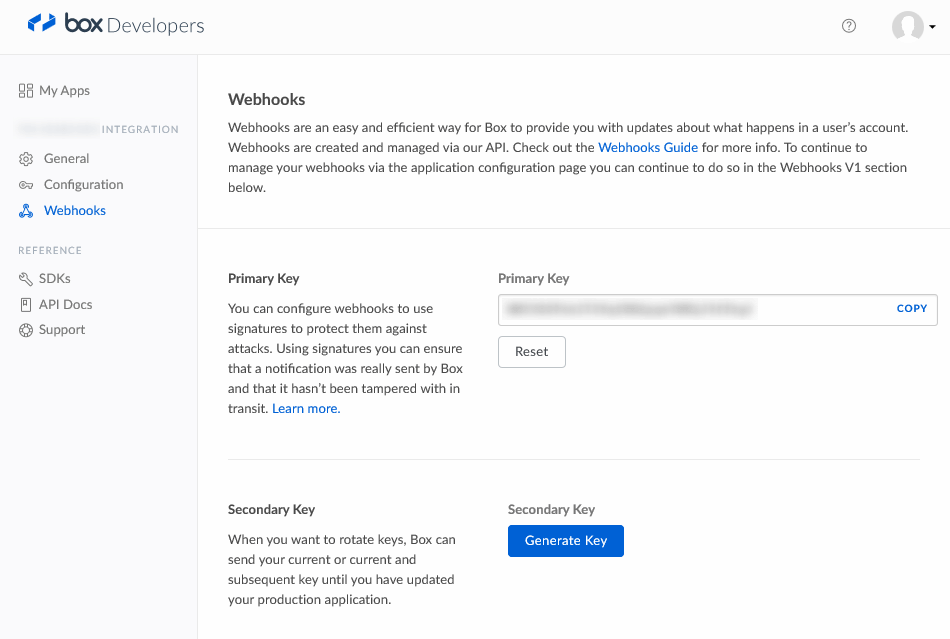

# Webhook support for Box in ASP.NET Core

Box webhooks feature allows apps to receive real-time notifications of changes to Box files and folders.

Thanks to https://github.com/anuraj/facebookwebhook for providing a baseline for this project.

# Configuring Project

1. Add [BoxWebHook](https://www.nuget.org/packages/BoxWebHook) NuGet package into your project
2. Modify your `ConfigureServices` method in `Startup.cs` file
```CSharp
public void ConfigureServices(IServiceCollection services)
{
    services.AddMvc()
      .SetCompatibilityVersion(CompatibilityVersion.Version_2_1)
      .AddBoxWebHooks();
}
```
3. Add webhook configuration in appsettings. This key is provided in the Box Dev Console.
```Javascript
"WebHooks": {
  "box": {
    "SecretKey": {
      "default": "[Signature Key]"
    }
  }
}
```

*Location of signature key*


4. Add Controller class with `[BoxWebHook]` attribute

```CSharp
public class BoxController : ControllerBase
{
    [BoxWebHook]
    public IActionResult BoxHandler(string id, string @event, JObject data)
    {
        if (ModelState.IsValid)
        {
            Console.WriteLine("Trigger {Event} for {Id} with payload {Data}", @event, id, data);
            return NoContent();
        }
        else
        {
            return BadRequest(ModelState);
        }
    }
}
```
# Configuring Webhook

Unfortunately there is no UI to do this, rather this must be done via the API.  See instructions for [Create Webhook for Folder](https://developer.box.com/en/guides/webhooks/manage/for-folder/) on Box.

The callback address will be https://server/api/webhooks/incoming/box and you'll need to replace server with your host.